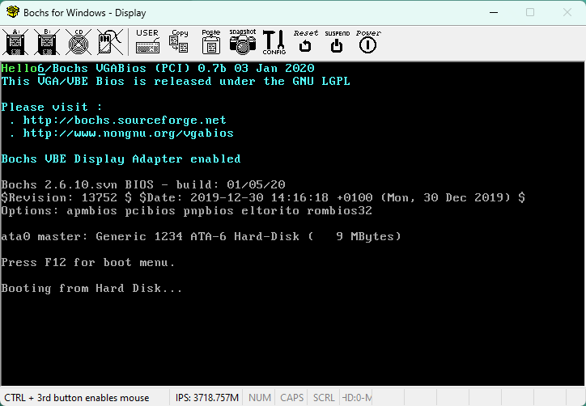

# os-dev-udemy-wsl

- [os-dev-udemy-wsl](#os-dev-udemy-wsl)
- [Overview](#overview)
- [Features](#features)
- [Requirements](#requirements)
- [Installation](#installation)
- [Build and run the project](#build-and-run-the-project)
- [How to contribute](#how-to-contribute)

# Overview

This project is a personal learning journey of developing a 64-bit monolithic
kernel operating system from scratch. It is based on the following online
courses (Udemy courses):
    - Operating System From Scratch by x-BIT Development.
    - Part A - Networking Projects - Implement TCP/IP Stack in C by Abhishek
      CSEPracticals.
    - Part B - Networking Projects - Implement TCP/IP Stack in C by Abhishek
      CSEPracticals.

A monolithic kernel is a type of kernel that contains all the operating
system’s core functions and device drivers in a single program running
in kernel mode. This means that the kernel can directly access and control
the hardware, without the need for any intermediate layer or message passing.
Monolithic kernels are usually faster and more efficient than other types of
kernels, such as microkernels or exokernels, which separate the core functions
and device drivers into different processes or modules.

One of the reasons why I decided to code a monolithic kernel instead of a
microkernel or an exokernel is that monolithic kernels are easier to design
and implement. Microkernels and exokernels require more code and complexity
to handle the communication and coordination between different components,
which can also introduce more bugs and security issues. Monolithic kernels,
on the other hand, have a simpler structure and a smaller code base, which
makes them more reliable and maintainable.

Another reason why I chose a monolithic kernel is that monolithic kernels are
more compatible with existing software and hardware. Microkernels and
exokernels often require modifying or rewriting the applications and drivers to
work with their architecture, which can be time-consuming and costly.
Monolithic kernels, however, can support a wide range of software and hardware
without much modification, as they have direct access to the system resources.

I hope this gives you a brief overview of what a monolithic kernel is and why
I prefer it over other types of kernels.

In addition to the basic features of an operating system, such as bootloader,
memory management, interrupts, drivers, processes, scheduling, and filesystem,
this project also aims to implement a TCP/IP stack that enables networking
capabilities for the operating system. A TCP/IP stack is a set of protocols
that defines how data is transmitted and received over the Internet. It
consists of four layers:
    - The application layer, which provides services for different applications
      to communicate with each other, such as HTTP.
    - The transport layer, which provides reliable data delivery between hosts,
      such as TCP.
    - The internet layer, which provides logical addressing and routing of
      packets across networks, such as IP or ICMP.
    - The link layer, which provides physical access to the network medium and
      data framing, such as Ethernet or ARP.

Implementing a TCP/IP stack in this project will allow the operating system
to communicate with other devices over the Internet, such as serving web pages.
It will also provide an opportunity to learn about the inner workings of
network protocols and how they interact with each other. However, implementing
a TCP/IP stack also poses some challenges, such as handling packet
fragmentation and reassembly, managing congestion control and flow control,
ensuring security and encryption of data, etc.

I hope this gives you a brief overview of what this project is about and why I
chose to develop it.

The project is developed using a bottom-up approach, starting from the lowest
level of abstraction (the bootloader) and gradually building up higher-level
features and components. The project is written in NASM assembly language and
C programming language.

# Features

The project is currently in progress. The following features are planned for
the future:

   - A custom bootloader that:
     - Loads the kernel into memory.
     - Sets up the GDT and IDT.
     - Enables protected mode and paging.
   - A VGA driver that:
     - Supports text mode and graphics mode.
     - Provides basic drawing functions.
     - Handles screen scrolling and cursor movement.
   - A keyboard driver that:
     - Handles keyboard input and interrupts.
     - Supports scan codes and ASCII codes.
     - Provides a buffer for storing keystrokes.
   - A memory manager that:
     - Implements paging and heap allocation.
     - Provides functions for allocating and freeing memory.
     - Detects and maps available physical memory.
   - A shell that:
     - Supports basic commands and user input.
     - Parses and executes commands from the keyboard buffer.
     - Provides a simple user interface.
   - A FAT16 driver that:
     - Allows reading files from a disk.
     - Supports partitions and boot sectors.
     - Provides functions for opening, closing, and reading files.
   - A network driver that supports packet I/O over Ethernet.
     - Supports packet I/O over Ethernet.
     - Handles network card initialization and interrupts.
     - Provides a buffer for storing packets.
   - A TCP/IP stack that implements ARP, IP, ICMP, and TCP protocols.
     - Implements ARP, IP, ICMP, and TCP protocols.
     - Provides functions for sending and receiving packets.
     - Handles checksums, fragmentation, reassembly, and retransmission.
   - A web server that serves static files over HTTP.
     - Serves static files over HTTP.
     - Supports GET and HEAD methods.
     - Handles multiple connections and requests.

# Requirements

To run this project, you need the following tools:

 - MinGW: A compiler toolchain for Windows that supports NASM and C
   (https://www.mingw.org/).
 - NASM: An assembler and disassembler for x86 architecture
   (https://www.nasm.us/).
 - Make: is a tool that automates the building of programs from source code
   (https://www.gnu.org/software/make/).
 - VS Code: A code editor with extensions for NASM and C syntax highlighting
   (https://code.visualstudio.com/).
 - Bochs: An emulator that can run the operating system image
   (https://bochs.sourceforge.io/).

# Installation

To install the tools needed to build the project, follow these steps:

   1. Enable Windows Subsystem for Linux in Windows 10/11
      (https://learn.microsoft.com/en-us/windows/wsl/install-manual).
   2. Install Ubuntu from the Microsoft Store.
   3. Install C compiler: `sudo apt-get install gcc`.
   4. To verify the installation, type `gcc --version`. You should see
      something like this:

      `gcc (Ubuntu 11.3.0-1ubuntu1~22.04) 11.3.0
       Copyright (C) 2021 Free Software Foundation, Inc.
       This is free software; see the source for copying conditions.  There is
       NO warranty; not even for MERCHANTABILITY or FITNESS FOR A PARTICULAR
       PURPOSE.`
   5. Install NASM assembler: `sudo apt-get install nasm`.
   6. To verify the installation, type `nasm --version`. You should see
      something like this:

      `NASM version 2.15.05`
   7. Install Make utility: `sudo apt-get install make`.
   8. To verify the installation, type `make --version`. You should see
      something like this:

      `GNU Make 4.3
       Built for x86_64-pc-linux-gnu
       Copyright (C) 1988-2020 Free Software Foundation, Inc.
       License GPLv3+: GNU GPL version 3 or later
       <http://gnu.org/licenses/gpl.html>
       This is free software: you are free to change and redistribute it.
       There is NO WARRANTY, to the extent permitted by law.`
   9. Download and install the Bochs emulator
      (https://sourceforge.net/projects/bochs/files/bochs/).
  10. Add environment variable (for Bochs) C:\Program Files\Bochs-2.6.11
   (The version might not be the same for you as in this path).
  11. Install Rufus, a tool for creating a bootable USB drive:
      1. Press Win + R together to open the Run window.
      2. Type cmd and press Enter to bring up the Command Prompt.
      3. Type the command `winget install Rufus.Rufus` and press Enter.

# Build and run the project

To build and run this project, follow these steps:

   1. Open the Ubuntu shell from the Start menu or by typing wsl in the Run
      dialog box (Win + R).
   2. Clone the project repository from GitHub by running this command:
      `git clone https://www.github.com/tricko93/os-dev-udemy-wsl os-dev`
   3. Change to the project directory by running this command:
      `cd os-dev`
   4. Create a hard disk image, 
      1. Press Win + R together to open the Run window.
      2. Cd into the directory where the project is located.
      3. Type the command: `bximage` and press enter.
         1. [0] 1
         2. [hd] hd
         3. [flat] flat
         4. [512] 512
         5. [10] 10
         6. [c.img] boot.img
   5. Configure the Bochs emulator with the disk geometry parameters.

      After creating the hard-disk image with bximage, you need to edit the
      bochsrc file, which is the configuration file for the Bochs emulator.
      You can find this file in the root folder where you cloned this project.
      You can use any text editor to open and modify this file.

      Look for the line that starts with `ata0-master` in the bochsrc file.
      This line tells Bochs how to use the disk image as the primary master
      device on the first ATA channel. You need to replace this line with
      the one that bximage printed after creating the disk image. For
      example, if bximage printed:
      `ata0-master: type=disk, path="boot.img", mode=flat`

      The following line should appear in your bochsrc:
      `ata0-master: type=disk, path="boot.img", mode=flat,
                                                cylinders=20, heads=16, spt=63`

      Then you need to copy and paste this line into your bochsrc file,
      replacing the existing `ata0-master` line. Make sure that the path
      of the disk image matches the location where you saved it. The cylinders,
      heads, and spt parameters are the disk geometry parameters that define
      how the disk is divided into logical blocks. These parameters must match
      the ones that bximage used to create the disk image, otherwise, Bochs may
      not be able to access it correctly.

      Save and close the bochsrc file after editing it. You have now configured
      the Bochs emulator with the disk geometry parameters.
   6. Build the OS binary and the hard disk image by running this command:
      `make`. This will create binary files: boot.bin, loader.bin,
      kernel.bin, and boot.img (hard disk image).
   7. Open File Explorer and navigate to the location where you cloned the
      project. You should see a folder named `os-dev` with the files inside.
   8. Double-click the `bochsrc.bxrc` file to launch the Bochs emulator. This
      will load the hard disk image and start the OS.
   9. You should see a window with a black background and some text.
      You should see something like this:

   

   10. That's it! Congratulations, you have successfully built and run your
      operating system project.

   NOTE: If, however, you get a PANIC error with the message "ata0-0: could not
   open hard drive image file 'boot.img'", after double-clicking the `bochsrc.bxrc`,
   you then must have left the file `boot.img.lock` in your root of the project.
   Just delete it and restart the Bochs again by double-clicking it, and that
   will resolve the error message.

# How to contribute

This project is a simple operating system (OS) that I developed following the
Udemy course on OS development. The OS can boot from a hard disk image and
display some text on the screen. I welcome any feedback, bug reports, feature
requests, or code contributions from anyone interested in this project.
Here are some ways you can contribute:

   - Feedback: If you have any questions or feedback about the project, please
     feel free to contact me at contact@markotrickovic.com. I would love to
     hear from you and learn how you use the project.
   - Bug reports: If you encounter any bugs or errors while using the project,
     please open an issue on GitHub and describe the problem in detail. Include
     information such as the steps to reproduce the bug, the expected and
     actual outcomes, and any screenshots or logs that might be relevant.
     Please also mention the version of the project and the environment (OS,
     emulator, etc.) that you are using.
   - Feature requests: If you have any ideas or suggestions for new features or
     improvements for the project, please open an issue on GitHub and explain
     what you want and why. Provide as much detail as possible about the
     desired functionality and use cases. Please also indicate if you are
     willing to work on implementing the feature yourself or if you need help
     from me or other contributors.
   - Code contributions: If you want to contribute code to the project, please
     fork the repository on GitHub and create a branch for your changes. Follow
     the coding style and conventions that are used in the existing codebase.
     Write clear and concise commit messages that describe what you have done
     and why. Create a pull request when you are ready to submit your changes
     for review.
